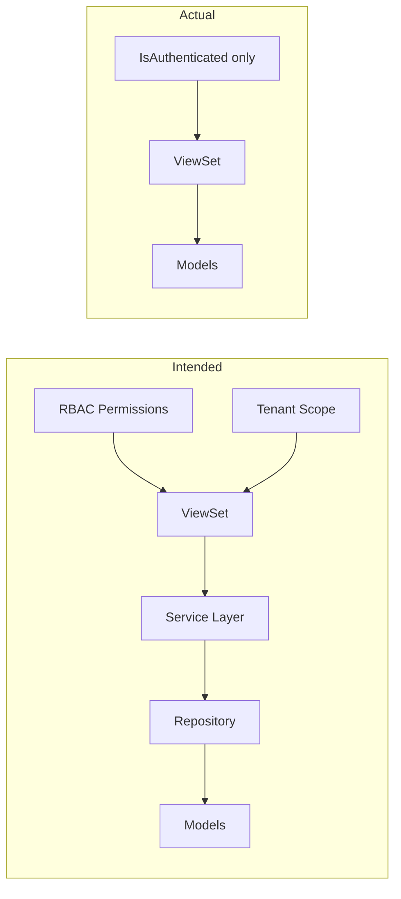

# HRMS Pro — Backend Audit & Design Review

**Review Date:** August 2026  
**Reviewer:** Architecture Audit  
**Verdict:** **Data layer is solid; API and business layers are largely scaffold — not production-ready.**

---

## Overall Scorecard

| Layer | Status | Score |
|-------|--------|-------|
| **Data Models** | Comprehensive, well-structured | 8/10 |
| **Database Design** | Multi-tenant base, constraints, migrations OK | 8/10 |
| **API Layer** | CRUD-only, no workflows | 3/10 |
| **Service Layer** | Minimal (AI stubs + export only) | 2/10 |
| **Security / RBAC** | Models exist, **not enforced** | 2/10 |
| **Tenant Isolation** | **Missing on ~55 viewsets** | 1/10 |
| **Celery / Async** | Tasks defined, **never invoked** | 2/10 |
| **Tests** | 6 smoke tests only | 1/10 |
| **Production Readiness** | Docker OK, app logic not ready | 4/10 |

**Bottom line:** The backend is a **well-designed database schema with auto-generated CRUD APIs**. It is **not** an implemented enterprise HRMS backend yet.

---

## What Was Actually Built vs Claimed

### ✅ Real implementation

| Component | Location | Notes |
|-----------|----------|-------|
| Custom User model + roles | `apps/accounts/models.py` | 12 roles defined |
| Auth backends (email/phone/LDAP) | `apps/accounts/backends.py` | LDAP optional |
| JWT + API tokens + MFA setup | `apps/accounts/views.py` | MFA not enforced on login |
| Audit log middleware | `apps/accounts/middleware.py` | Logs URL path only, not model changes |
| AI keyword services | `apps/ai_features/services.py` | Heuristics, not ML/LLM |
| Report export (PDF/Excel) | `apps/reports/services.py` | Works |
| Dashboard stats | `apps/dashboard/views.py`, `apps/reports/views.py` | Partial company scoping |
| Celery task definitions | `apps/core/tasks.py` | Never called |
| 58+ Django models | All `apps/*/models.py` | Good domain coverage |
| Migrations | All apps | Up to date |

### ❌ Scaffold only (CRUD with `fields = '__all__'`)

All of these are **ModelViewSet + IsAuthenticated** with **no business logic**:

- `employees`, `recruitment`, `payroll`, `leave`, `attendance`
- `performance`, `relations`, `disciplinary`, `casuals`, `surveys`
- `integrations`, `notifications` (partial), `core`

### ❌ Missing entirely

| Expected Feature | Status |
|------------------|--------|
| Payroll calculation engine | Not built |
| Leave approval workflow | Not built |
| Leave balance validation | Not built |
| Payslip PDF generation in payroll flow | Not built |
| Attendance check-in/out logic | Not built |
| Biometric device sync | Not built |
| RBAC permission enforcement | Not built |
| Tenant-scoped querysets | Not built |
| Notification dispatcher (email/SMS) | Not built |
| ERP/payment integrations | Models only |
| OpenAI / real AI integration | Config only |
| `@action` endpoints (approve, process, clock-in) | Zero in codebase |
| Service layer for domains | 2 files only |

---

## Architecture Review

### Intended vs Actual



**Design intent** (from README): service layer, repository pattern, RBAC, API-first.  
**Actual pattern:** ViewSet → ORM direct, global querysets, authentication only.

### Layer Diagram (Current State)

```
┌─────────────────────────────────────────────────────────┐
│  Client (Dashboard / API / Mobile)                       │
└──────────────────────────┬──────────────────────────────┘
                           │
┌──────────────────────────▼──────────────────────────────┐
│  Middleware: Security, Auth, Audit (partial), Session      │
└──────────────────────────┬──────────────────────────────┘
                           │
┌──────────────────────────▼──────────────────────────────┐
│  DRF ViewSets (~60) — IsAuthenticated ONLY               │
│  ⚠ No tenant filter  ⚠ No RBAC  ⚠ fields='__all__'      │
└──────────────────────────┬──────────────────────────────┘
                           │
         ┌─────────────────┼─────────────────┐
         │                 │                 │
         ▼                 ▼                 ▼
   ai_features/      reports/          (nothing)
   services.py       services.py       payroll, leave,
   (stubs)           (export)          attendance, etc.
         │                 │
         └────────┬────────┘
                  ▼
┌─────────────────────────────────────────────────────────┐
│  Django Models (58+ tables) — WELL DESIGNED              │
└──────────────────────────┬──────────────────────────────┘
                           ▼
                    PostgreSQL / SQLite
```

---

## CRITICAL Security Findings

### C1 — Open registration with role escalation

```python
# apps/accounts/views.py — AllowAny registration
# apps/accounts/serializers.py — accepts 'role', 'company' in create payload
```

Anyone can POST to `/api/v1/auth/register/` with `"role": "super_admin"`.

### C2 — No multi-tenant isolation

```python
# apps/employees/views.py
queryset = Employee.objects.filter(is_deleted=False)  # ALL companies
```

Same on payroll, leave, attendance, and every domain viewset (~55 total).

### C3 — Sensitive data exposed via API

`fields = '__all__'` exposes:
- `IntegrationProvider.credentials` (JSON secrets)
- `WebhookEndpoint.secret`
- `Employee.bank_account_number`, `social_security_number`, `tax_id`

### C4 — UserViewSet is globally open

Any authenticated user can list/modify all users and roles.

### C5 — RBAC is decorative

- `User.role` — 12 roles defined, **never checked in views**
- `PermissionGroup.permissions` — JSON field, **never enforced**
- `IsCompanyMember` in `apps/core/permissions.py` — **defined, never used**

---

## HIGH Priority Design Issues

### H1 — Broken API routes

Router registers empty-prefix viewset **before** named routes:

| URL | Expected | Actual |
|-----|----------|--------|
| `/api/v1/employees/contracts/` | Contract list | Employee detail pk=`"contracts"` |
| `/api/v1/notifications/announcements/` | Announcements | Broken PK capture |
| `/api/v1/surveys/questions/` | Questions | Broken PK capture |

### H2 — Celery tasks are orphaned

| Task | Defined | Invoked | Scheduled |
|------|---------|---------|-----------|
| `process_payroll_run` | ✅ | ❌ | ❌ |
| `screen_applicant_resume` | ✅ | ❌ | ❌ |
| `send_notification_email` | ✅ | ❌ | ❌ |
| `accrue_leave_balances` | ✅ | ❌ | ❌ |

`process_payroll_run` only runs anomaly check — **does not calculate payslips**.

### H3 — No workflow state machines

Models have status fields (`LeaveRequest.status`, `PayrollRun.status`) but:
- No validation on status transitions
- No `@action` endpoints for approve/reject/process
- No signals to update related records (balances, attendance)

### H4 — N+1 query risk

Zero `select_related` / `prefetch_related` in any viewset. List endpoints will degrade at scale.

### H5 — Dashboard stats leak cross-company data

```python
# apps/dashboard/views.py — LeaveRequest, AttendanceRecord not filtered by company
LeaveRequest.objects.filter(status='approved', ...)
```

---

## Model Layer Review (Strong)

### Strengths

- `CompanyScopedModel` — correct multi-tenant foundation
- `SoftDeleteModel` on Employee
- `AuditableModel` with created_by/updated_by
- UUID PKs on transactional entities
- `unique_together` on tenant-scoped codes
- Comprehensive domain coverage matching enterprise HRMS spec

### Weaknesses

| Issue | Location |
|-------|----------|
| `EmployeeHistory` lacks `company_id` | `apps/employees/models.py` |
| Missing composite indexes `(company, status)` | leave, payroll, attendance |
| Only `AuditLog` has explicit composite indexes | `apps/accounts/models.py` |

---

## Service Layer Gap Analysis

| Domain | Required Service | Exists? |
|--------|------------------|---------|
| Payroll | Calculate gross/net, tax, statutory, generate payslips | ❌ |
| Leave | Balance check, accrual, approval chain | ❌ |
| Attendance | Check-in/out, overtime, roster validation | ❌ |
| Recruitment | Pipeline transitions, hire → employee | ❌ |
| Notifications | Multi-channel dispatch | ❌ |
| Integrations | Sync, webhook delivery, encrypt credentials | ❌ |
| Permissions | Role + group enforcement | ❌ |
| AI | Resume screening | ⚠ Stub (keyword match) |
| Reports | PDF/Excel export | ✅ |

---

## Test Coverage

**6 tests total** in `tests/test_api.py`:

- Registration (201 only)
- JWT (accepts 200 **or** 401 — non-deterministic)
- List/create employee
- List companies
- Chatbot keyword

**Not tested:** tenant isolation, RBAC, MFA, payroll, leave workflows, credential exposure, broken routes, Celery.

---

## Recommended Fix Roadmap

### Phase 1 — Security (Block production)

1. Create `CompanyScopedViewSet` base class — auto-filter by `request.user.company`
2. Apply `IsCompanyMember` on all object permissions
3. Lock registration — remove `role`/`company` from public serializer
4. Implement `RolePermission` class mapping `User.role` to allowed actions
5. Redact sensitive fields in serializers (credentials, SSN, bank)
6. Restrict `UserViewSet` to admin roles

### Phase 2 — API correctness

7. Fix router URL ordering (named routes before empty prefix)
8. Scope AI chatbot messages and analysis jobs to user/company
9. Add `select_related`/`prefetch_related` on list viewsets
10. Split serializers into dedicated files with explicit fields

### Phase 3 — Business logic

11. `PayrollService` — calculation, payslip generation, approval flow
12. `LeaveService` — balance validation, multi-level approval, accrual
13. `AttendanceService` — check-in/out, overtime calculation
14. `@action` endpoints: approve leave, process payroll, clock-in
15. Wire Celery tasks + beat schedule

### Phase 4 — Quality

16. Expand tests (tenant isolation, RBAC, workflows)
17. Split settings: `base.py` / `production.py`, wire Sentry
18. Improve audit middleware (response status, object_id, async)
19. Add composite DB indexes

---

## Conclusion

The project delivers:

- ✅ A **complete ER model** suitable for enterprise HRMS
- ✅ **Project scaffolding** (Docker, CI, docs, dashboard shell)
- ✅ **Authentication infrastructure** (JWT, MFA setup, backends)
- ❌ **Not** working payroll, leave workflows, attendance, RBAC, or tenant isolation
- ❌ **Not** safe for production due to open registration and cross-tenant data access

**Honest assessment:** ~**30% of backend work complete** — models and infrastructure are done; the business logic, security enforcement, and service layer that make it an HRMS are not.

---

*Next step: implement Phase 1 security fixes before any further feature work.*
