# HRMS Pro — System Design Documentation

**Version:** 1.0.0  
**Date:** August 2026  
**Platform:** Django 5 + PostgreSQL + Redis + Celery

---

## Table of Contents

1. [System Overview](#1-system-overview)
2. [Architecture Flow](#2-architecture-flow)
3. [Authentication Flow](#3-authentication-flow)
4. [Business Process Flowcharts](#4-business-process-flowcharts)
5. [Database Design (ER Diagram)](#5-database-design-er-diagram)
6. [Entity Relationships by Module](#6-entity-relationships-by-module)
7. [Table Reference](#7-table-reference)

---

## 1. System Overview

HRMS Pro is an enterprise Human Resource Management System that consolidates HR, payroll, leave, recruitment, attendance, and performance management into a single multi-tenant platform.

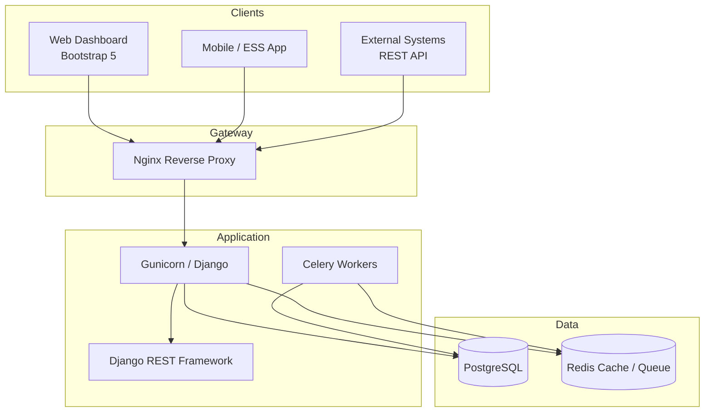
```mermaid
flowchart TB
    subgraph Clients
        WEB[Web Dashboard<br/>Bootstrap 5]
        MOB[Mobile / ESS App]
        API_CLIENT[External Systems<br/>REST API]
    end

    subgraph Gateway
        NGINX[Nginx Reverse Proxy]
    end

    subgraph Application
        GUNICORN[Gunicorn / Django]
        DRF[Django REST Framework]
        CELERY[Celery Workers]
    end

    subgraph Data
        PG[(PostgreSQL)]
        REDIS[(Redis Cache / Queue)]
    end

    WEB --> NGINX
    MOB --> NGINX
    API_CLIENT --> NGINX
    NGINX --> GUNICORN
    GUNICORN --> DRF
    GUNICORN --> PG
    GUNICORN --> REDIS
    CELERY --> REDIS
    CELERY --> PG
```

### Module Map

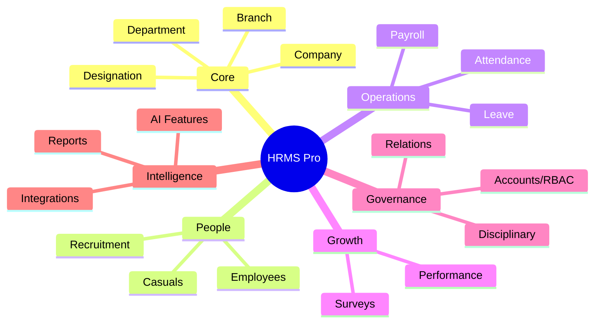
```mermaid
mindmap
  root((HRMS Pro))
    Core
      Company
      Branch
      Department
      Designation
    People
      Employees
      Recruitment
      Casuals
    Operations
      Leave
      Attendance
      Payroll
    Growth
      Performance
      Surveys
    Governance
      Relations
      Disciplinary
      Accounts/RBAC
    Intelligence
      AI Features
      Reports
      Integrations
```

---

## 2. Architecture Flow

### Request Lifecycle

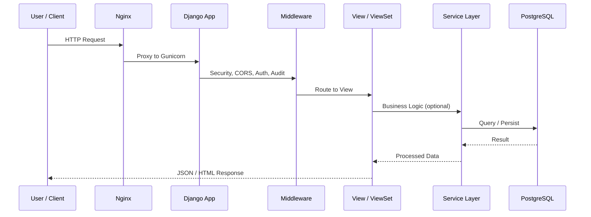
```mermaid
sequenceDiagram
    participant U as User / Client
    participant N as Nginx
    participant D as Django App
    participant M as Middleware
    participant V as View / ViewSet
    participant S as Service Layer
    participant DB as PostgreSQL

    U->>N: HTTP Request
    N->>D: Proxy to Gunicorn
    D->>M: Security, CORS, Auth, Audit
    M->>V: Route to View
    V->>S: Business Logic (optional)
    S->>DB: Query / Persist
    DB-->>S: Result
    S-->>V: Processed Data
    V-->>U: JSON / HTML Response
```

### Multi-Tenant Data Scoping

Every business entity (except global auth) is scoped to a **Company**:

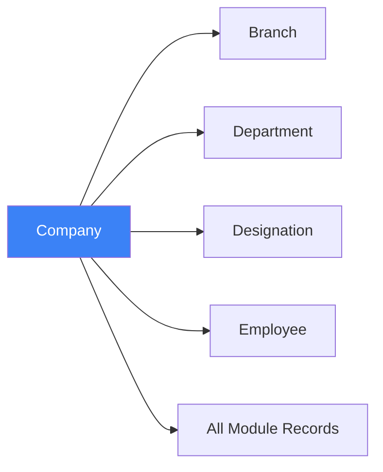
```mermaid
flowchart LR
    COMPANY[Company] --> BRANCH[Branch]
    COMPANY --> DEPT[Department]
    COMPANY --> DESIG[Designation]
    COMPANY --> EMP[Employee]
    COMPANY --> ALL[All Module Records]

    style COMPANY fill:#3b82f6,color:#fff
```

---

## 3. Authentication Flow

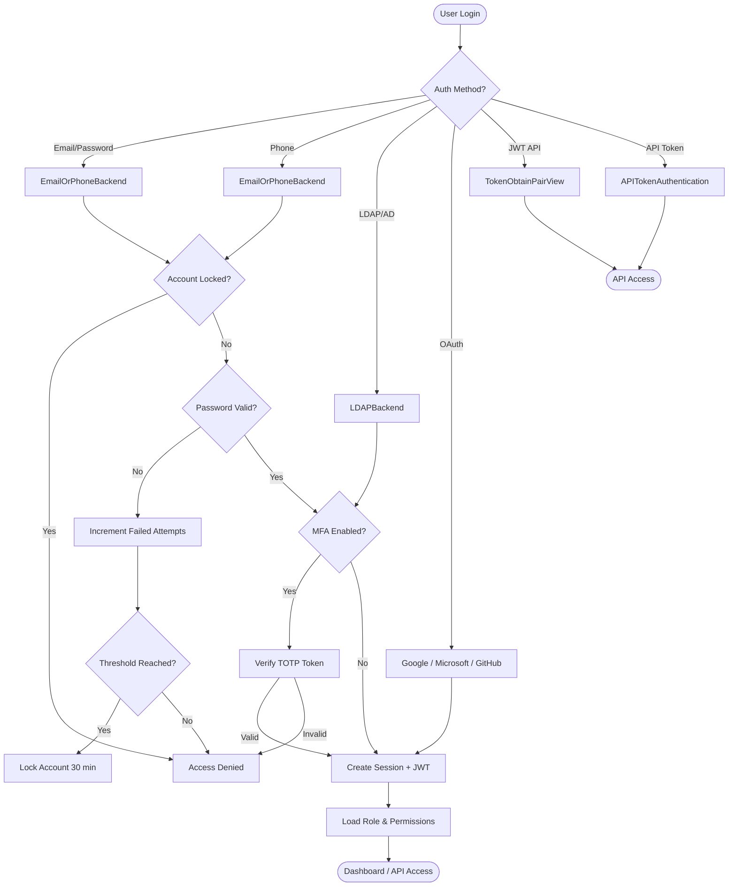
```mermaid
flowchart TD
    START([User Login]) --> METHOD{Auth Method?}

    METHOD -->|Email/Password| EMAIL[EmailOrPhoneBackend]
    METHOD -->|Phone| PHONE[EmailOrPhoneBackend]
    METHOD -->|LDAP/AD| LDAP[LDAPBackend]
    METHOD -->|OAuth| OAUTH[Google / Microsoft / GitHub]
    METHOD -->|JWT API| JWT[TokenObtainPairView]
    METHOD -->|API Token| TOKEN[APITokenAuthentication]

    EMAIL --> LOCK{Account Locked?}
    PHONE --> LOCK
    LOCK -->|Yes| DENY[Access Denied]
    LOCK -->|No| PWD{Password Valid?}

    PWD -->|No| FAIL[Increment Failed Attempts]
    FAIL --> THRESH{Threshold Reached?}
    THRESH -->|Yes| LOCKOUT[Lock Account 30 min]
    THRESH -->|No| DENY

    PWD -->|Yes| MFA{MFA Enabled?}
    LDAP --> MFA
    OAUTH --> SESSION

    MFA -->|Yes| TOTP[Verify TOTP Token]
    MFA -->|No| SESSION[Create Session + JWT]
    TOTP -->|Valid| SESSION
    TOTP -->|Invalid| DENY

    SESSION --> RBAC[Load Role & Permissions]
    RBAC --> DASH([Dashboard / API Access])

    JWT --> API([API Access])
    TOKEN --> API
```

### User Roles

| Role | Codename | Primary Access |
|------|----------|----------------|
| Super Admin | `super_admin` | Full system |
| HR Administrator | `hr_admin` | HR modules |
| Payroll Officer | `payroll_officer` | Payroll processing |
| Recruiter | `recruiter` | Recruitment |
| Manager | `manager` | Team approvals |
| Supervisor | `supervisor` | Team oversight |
| Employee | `employee` | Self-service (ESS) |
| Finance Officer | `finance_officer` | Financial reports |
| Department Head | `dept_head` | Department data |
| Casual Supervisor | `casual_supervisor` | Casual workers |
| Auditor | `auditor` | Read-only audit |

---

## 4. Business Process Flowcharts

### 4.1 Recruitment & Onboarding

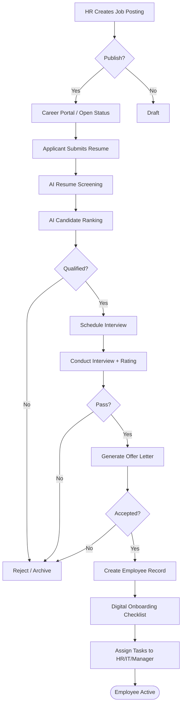
```mermaid
flowchart TD
    A[HR Creates Job Posting] --> B{Publish?}
    B -->|Yes| C[Career Portal / Open Status]
    B -->|No| D[Draft]
    C --> E[Applicant Submits Resume]
    E --> F[AI Resume Screening]
    F --> G[AI Candidate Ranking]
    G --> H{Qualified?}
    H -->|No| I[Reject / Archive]
    H -->|Yes| J[Schedule Interview]
    J --> K[Conduct Interview + Rating]
    K --> L{Pass?}
    L -->|No| I
    L -->|Yes| M[Generate Offer Letter]
    M --> N{Accepted?}
    N -->|No| I
    N -->|Yes| O[Create Employee Record]
    O --> P[Digital Onboarding Checklist]
    P --> Q[Assign Tasks to HR/IT/Manager]
    Q --> R([Employee Active])
```

### 4.2 Leave Management

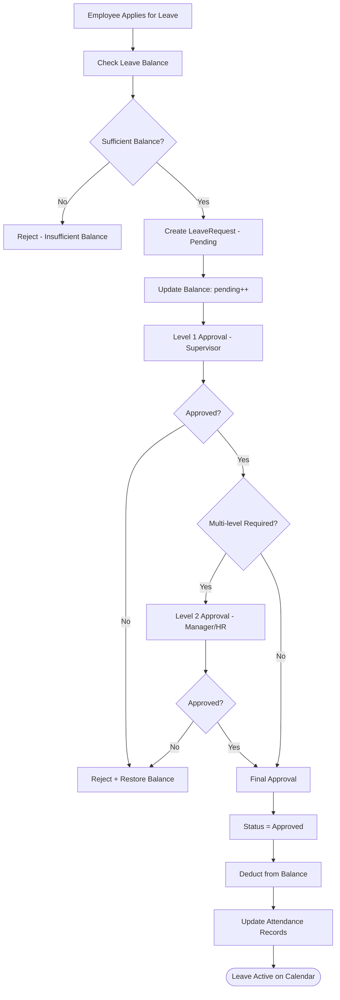
```mermaid
flowchart TD
    A[Employee Applies for Leave] --> B[Check Leave Balance]
    B --> C{Sufficient Balance?}
    C -->|No| D[Reject - Insufficient Balance]
    C -->|Yes| E[Create LeaveRequest - Pending]
    E --> F[Update Balance: pending++]
    F --> G[Level 1 Approval - Supervisor]
    G --> H{Approved?}
    H -->|No| I[Reject + Restore Balance]
    H -->|Yes| J{Multi-level Required?}
    J -->|Yes| K[Level 2 Approval - Manager/HR]
    K --> L{Approved?}
    L -->|No| I
    L -->|Yes| M[Final Approval]
    J -->|No| M
    M --> N[Status = Approved]
    N --> O[Deduct from Balance]
    O --> P[Update Attendance Records]
    P --> Q([Leave Active on Calendar])
```

### 4.3 Payroll Processing

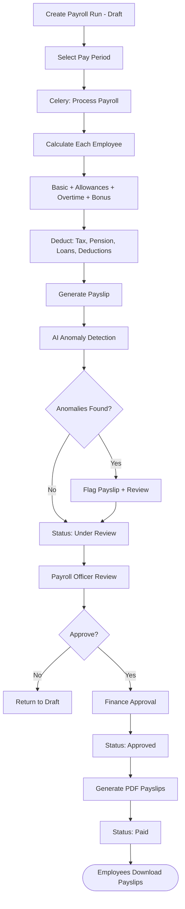
```mermaid
flowchart TD
    A[Create Payroll Run - Draft] --> B[Select Pay Period]
    B --> C[Celery: Process Payroll]
    C --> D[Calculate Each Employee]
    D --> E[Basic + Allowances + Overtime + Bonus]
    E --> F[Deduct: Tax, Pension, Loans, Deductions]
    F --> G[Generate Payslip]
    G --> H[AI Anomaly Detection]
    H --> I{Anomalies Found?}
    I -->|Yes| J[Flag Payslip + Review]
    I -->|No| K[Status: Under Review]
    J --> K
    K --> L[Payroll Officer Review]
    L --> M{Approve?}
    M -->|No| N[Return to Draft]
    M -->|Yes| O[Finance Approval]
    O --> P[Status: Approved]
    P --> Q[Generate PDF Payslips]
    Q --> R[Status: Paid]
    R --> S([Employees Download Payslips])
```

### 4.4 Time & Attendance

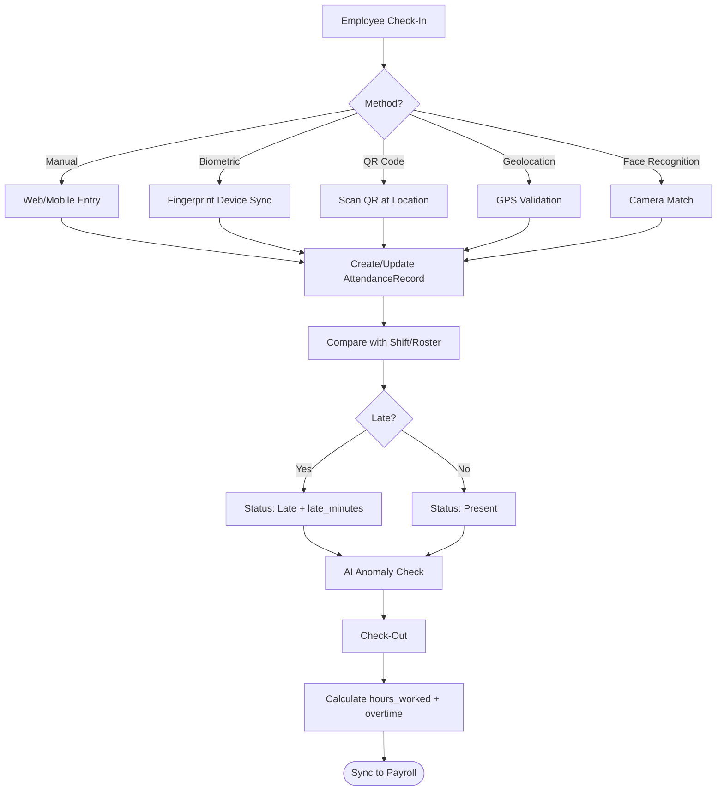
```mermaid
flowchart TD
    A[Employee Check-In] --> B{Method?}
    B -->|Manual| C[Web/Mobile Entry]
    B -->|Biometric| D[Fingerprint Device Sync]
    B -->|QR Code| E[Scan QR at Location]
    B -->|Geolocation| F[GPS Validation]
    B -->|Face Recognition| G[Camera Match]

    C --> H[Create/Update AttendanceRecord]
    D --> H
    E --> H
    F --> H
    G --> H

    H --> I[Compare with Shift/Roster]
    I --> J{Late?}
    J -->|Yes| K[Status: Late + late_minutes]
    J -->|No| L[Status: Present]
    K --> M[AI Anomaly Check]
    L --> M
    M --> N[Check-Out]
    N --> O[Calculate hours_worked + overtime]
    O --> P([Sync to Payroll])
```

### 4.5 Performance Review Cycle

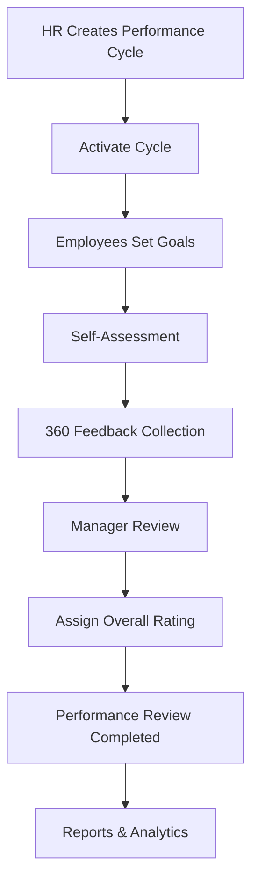
```mermaid
flowchart TD
    A[HR Creates Performance Cycle] --> B[Activate Cycle]
    B --> C[Employees Set Goals]
    C --> D[Self-Assessment]
    D --> E[360 Feedback Collection]
    E --> F[Manager Review]
    F --> G[Assign Overall Rating]
    G --> H[Performance Review Completed]
    H --> I[Reports & Analytics]
```

### 4.6 Disciplinary Process

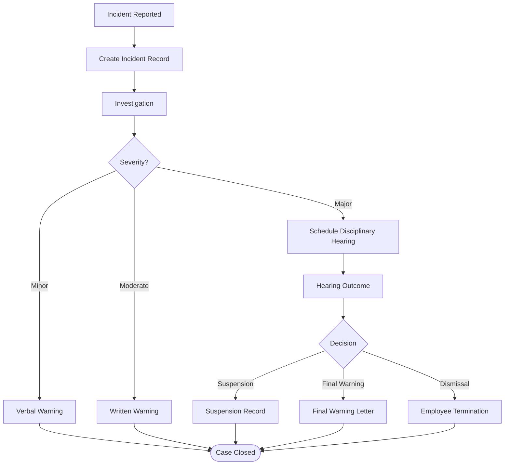
```mermaid
flowchart TD
    A[Incident Reported] --> B[Create Incident Record]
    B --> C[Investigation]
    C --> D{Severity?}
    D -->|Minor| E[Verbal Warning]
    D -->|Moderate| F[Written Warning]
    D -->|Major| G[Schedule Disciplinary Hearing]
    G --> H[Hearing Outcome]
    H --> I{Decision}
    I -->|Suspension| J[Suspension Record]
    I -->|Final Warning| K[Final Warning Letter]
    I -->|Dismissal| L[Employee Termination]
    E --> M([Case Closed])
    F --> M
    J --> M
    K --> M
    L --> M
```

---

## 5. Database Design (ER Diagram)

### 5.1 Core & Organization (Central Hub)

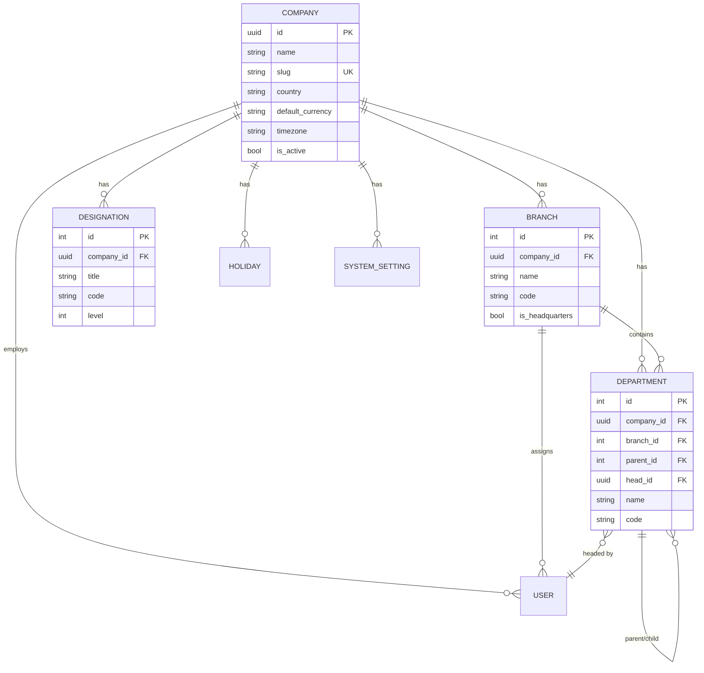
```mermaid
erDiagram
    COMPANY ||--o{ BRANCH : has
    COMPANY ||--o{ DEPARTMENT : has
    COMPANY ||--o{ DESIGNATION : has
    COMPANY ||--o{ HOLIDAY : has
    COMPANY ||--o{ SYSTEM_SETTING : has
    COMPANY ||--o{ USER : employs

    BRANCH ||--o{ DEPARTMENT : contains
    BRANCH ||--o{ USER : assigns
    DEPARTMENT ||--o{ DEPARTMENT : "parent/child"
    DEPARTMENT }o--|| USER : "headed by"

    COMPANY {
        uuid id PK
        string name
        string slug UK
        string country
        string default_currency
        string timezone
        bool is_active
    }

    BRANCH {
        int id PK
        uuid company_id FK
        string name
        string code
        bool is_headquarters
    }

    DEPARTMENT {
        int id PK
        uuid company_id FK
        int branch_id FK
        int parent_id FK
        uuid head_id FK
        string name
        string code
    }

    DESIGNATION {
        int id PK
        uuid company_id FK
        string title
        string code
        int level
    }
```

### 5.2 Authentication & Security

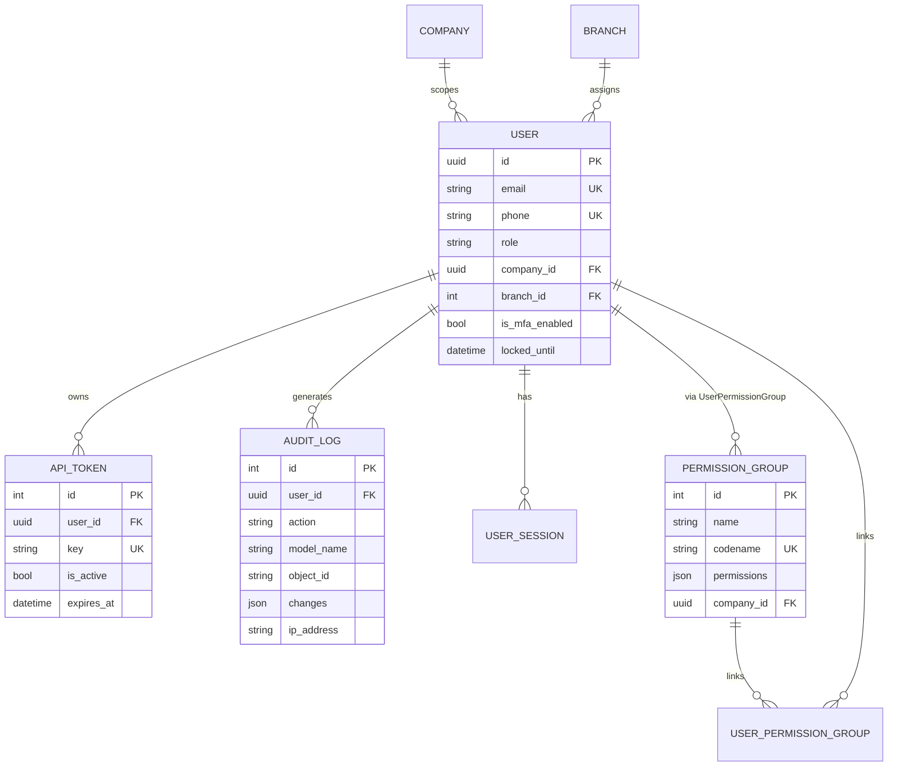
```mermaid
erDiagram
    COMPANY ||--o{ USER : scopes
    BRANCH ||--o{ USER : assigns
    USER ||--o{ API_TOKEN : owns
    USER ||--o{ AUDIT_LOG : generates
    USER ||--o{ USER_SESSION : has
    USER ||--o{ PERMISSION_GROUP : "via UserPermissionGroup"

    PERMISSION_GROUP ||--o{ USER_PERMISSION_GROUP : links
    USER ||--o{ USER_PERMISSION_GROUP : links

    USER {
        uuid id PK
        string email UK
        string phone UK
        string role
        uuid company_id FK
        int branch_id FK
        bool is_mfa_enabled
        datetime locked_until
    }

    PERMISSION_GROUP {
        int id PK
        string name
        string codename UK
        json permissions
        uuid company_id FK
    }

    API_TOKEN {
        int id PK
        uuid user_id FK
        string key UK
        bool is_active
        datetime expires_at
    }

    AUDIT_LOG {
        int id PK
        uuid user_id FK
        string action
        string model_name
        string object_id
        json changes
        string ip_address
    }
```

### 5.3 Employee Management

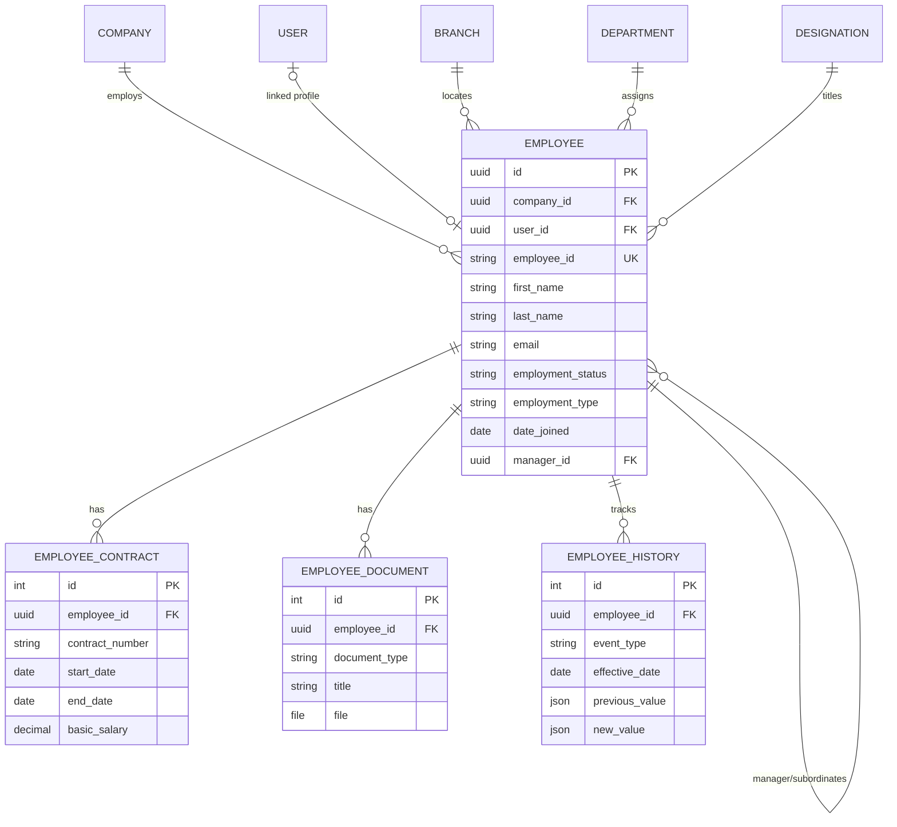
```mermaid
erDiagram
    COMPANY ||--o{ EMPLOYEE : employs
    USER |o--o| EMPLOYEE : "linked profile"
    BRANCH ||--o{ EMPLOYEE : locates
    DEPARTMENT ||--o{ EMPLOYEE : assigns
    DESIGNATION ||--o{ EMPLOYEE : titles
    EMPLOYEE ||--o{ EMPLOYEE : "manager/subordinates"

    EMPLOYEE ||--o{ EMPLOYEE_CONTRACT : has
    EMPLOYEE ||--o{ EMPLOYEE_DOCUMENT : has
    EMPLOYEE ||--o{ EMPLOYEE_HISTORY : tracks

    EMPLOYEE {
        uuid id PK
        uuid company_id FK
        uuid user_id FK
        string employee_id UK
        string first_name
        string last_name
        string email
        string employment_status
        string employment_type
        date date_joined
        uuid manager_id FK
    }

    EMPLOYEE_CONTRACT {
        int id PK
        uuid employee_id FK
        string contract_number
        date start_date
        date end_date
        decimal basic_salary
    }

    EMPLOYEE_DOCUMENT {
        int id PK
        uuid employee_id FK
        string document_type
        string title
        file file
    }

    EMPLOYEE_HISTORY {
        int id PK
        uuid employee_id FK
        string event_type
        date effective_date
        json previous_value
        json new_value
    }
```

### 5.4 Recruitment

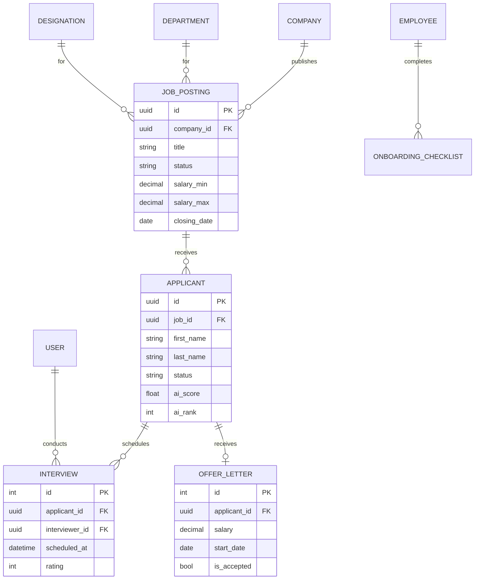
```mermaid
erDiagram
    COMPANY ||--o{ JOB_POSTING : publishes
    DEPARTMENT ||--o{ JOB_POSTING : for
    DESIGNATION ||--o{ JOB_POSTING : for
    JOB_POSTING ||--o{ APPLICANT : receives
    APPLICANT ||--o{ INTERVIEW : schedules
    APPLICANT ||--o| OFFER_LETTER : receives
    EMPLOYEE ||--o{ ONBOARDING_CHECKLIST : completes
    USER ||--o{ INTERVIEW : conducts

    JOB_POSTING {
        uuid id PK
        uuid company_id FK
        string title
        string status
        decimal salary_min
        decimal salary_max
        date closing_date
    }

    APPLICANT {
        uuid id PK
        uuid job_id FK
        string first_name
        string last_name
        string status
        float ai_score
        int ai_rank
    }

    INTERVIEW {
        int id PK
        uuid applicant_id FK
        uuid interviewer_id FK
        datetime scheduled_at
        int rating
    }

    OFFER_LETTER {
        int id PK
        uuid applicant_id FK
        decimal salary
        date start_date
        bool is_accepted
    }
```

### 5.5 Payroll

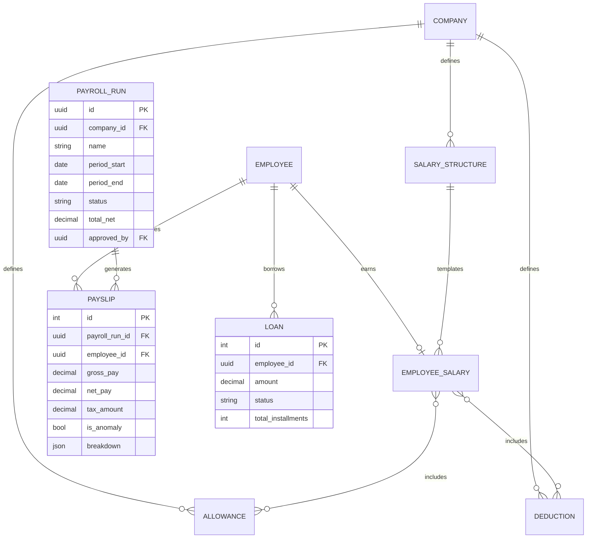
```mermaid
erDiagram
    COMPANY ||--o{ SALARY_STRUCTURE : defines
    COMPANY ||--o{ ALLOWANCE : defines
    COMPANY ||--o{ DEDUCTION : defines
    EMPLOYEE ||--o| EMPLOYEE_SALARY : earns
    EMPLOYEE ||--o{ PAYSLIP : receives
    EMPLOYEE ||--o{ LOAN : borrows
    PAYROLL_RUN ||--o{ PAYSLIP : generates

    EMPLOYEE_SALARY }o--o{ ALLOWANCE : includes
    EMPLOYEE_SALARY }o--o{ DEDUCTION : includes
    SALARY_STRUCTURE ||--o{ EMPLOYEE_SALARY : templates

    PAYROLL_RUN {
        uuid id PK
        uuid company_id FK
        string name
        date period_start
        date period_end
        string status
        decimal total_net
        uuid approved_by FK
    }

    PAYSLIP {
        int id PK
        uuid payroll_run_id FK
        uuid employee_id FK
        decimal gross_pay
        decimal net_pay
        decimal tax_amount
        bool is_anomaly
        json breakdown
    }

    LOAN {
        int id PK
        uuid employee_id FK
        decimal amount
        string status
        int total_installments
    }
```

### 5.6 Leave Management

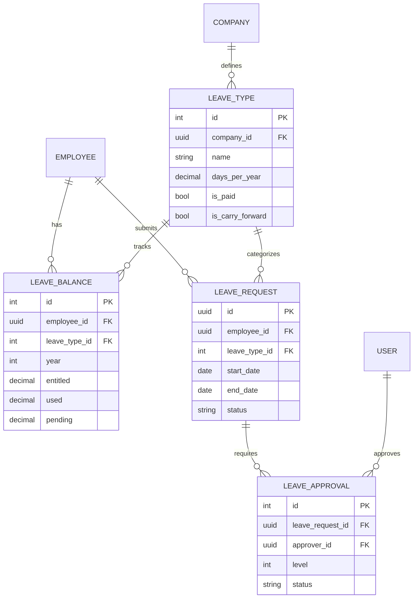
```mermaid
erDiagram
    COMPANY ||--o{ LEAVE_TYPE : defines
    EMPLOYEE ||--o{ LEAVE_BALANCE : has
    EMPLOYEE ||--o{ LEAVE_REQUEST : submits
    LEAVE_TYPE ||--o{ LEAVE_BALANCE : tracks
    LEAVE_TYPE ||--o{ LEAVE_REQUEST : categorizes
    LEAVE_REQUEST ||--o{ LEAVE_APPROVAL : requires
    USER ||--o{ LEAVE_APPROVAL : approves

    LEAVE_TYPE {
        int id PK
        uuid company_id FK
        string name
        decimal days_per_year
        bool is_paid
        bool is_carry_forward
    }

    LEAVE_BALANCE {
        int id PK
        uuid employee_id FK
        int leave_type_id FK
        int year
        decimal entitled
        decimal used
        decimal pending
    }

    LEAVE_REQUEST {
        uuid id PK
        uuid employee_id FK
        int leave_type_id FK
        date start_date
        date end_date
        string status
    }

    LEAVE_APPROVAL {
        int id PK
        uuid leave_request_id FK
        uuid approver_id FK
        int level
        string status
    }
```

### 5.7 Attendance

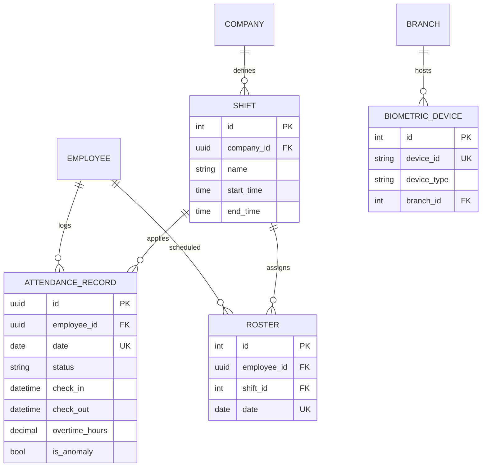
```mermaid
erDiagram
    COMPANY ||--o{ SHIFT : defines
    EMPLOYEE ||--o{ ATTENDANCE_RECORD : logs
    EMPLOYEE ||--o{ ROSTER : scheduled
    SHIFT ||--o{ ATTENDANCE_RECORD : applies
    SHIFT ||--o{ ROSTER : assigns
    BRANCH ||--o{ BIOMETRIC_DEVICE : hosts

    SHIFT {
        int id PK
        uuid company_id FK
        string name
        time start_time
        time end_time
    }

    ATTENDANCE_RECORD {
        uuid id PK
        uuid employee_id FK
        date date UK
        string status
        datetime check_in
        datetime check_out
        decimal overtime_hours
        bool is_anomaly
    }

    ROSTER {
        int id PK
        uuid employee_id FK
        int shift_id FK
        date date UK
    }

    BIOMETRIC_DEVICE {
        int id PK
        string device_id UK
        string device_type
        int branch_id FK
    }
```

### 5.8 Full System Relationship Overview

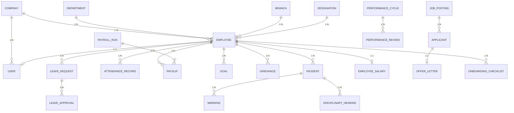
```mermaid
erDiagram
    COMPANY ||--o{ EMPLOYEE : "1:N"
    COMPANY ||--o{ USER : "1:N"
    EMPLOYEE ||--o{ LEAVE_REQUEST : "1:N"
    EMPLOYEE ||--o{ ATTENDANCE_RECORD : "1:N"
    EMPLOYEE ||--o{ PAYSLIP : "1:N"
    EMPLOYEE ||--o{ GOAL : "1:N"
    EMPLOYEE ||--o{ GRIEVANCE : "1:N"
    EMPLOYEE ||--o{ INCIDENT : "1:N"
    EMPLOYEE ||--o| EMPLOYEE_SALARY : "1:1"
    EMPLOYEE |o--o| USER : "1:1"

    DEPARTMENT ||--o{ EMPLOYEE : "1:N"
    BRANCH ||--o{ EMPLOYEE : "1:N"
    DESIGNATION ||--o{ EMPLOYEE : "1:N"

    JOB_POSTING ||--o{ APPLICANT : "1:N"
    APPLICANT ||--o| OFFER_LETTER : "1:1"
    EMPLOYEE ||--o{ ONBOARDING_CHECKLIST : "1:N"

    PAYROLL_RUN ||--o{ PAYSLIP : "1:N"
    LEAVE_REQUEST ||--o{ LEAVE_APPROVAL : "1:N"
    PERFORMANCE_CYCLE ||--o{ PERFORMANCE_REVIEW : "1:N"
    INCIDENT ||--o{ WARNING : "1:N"
    INCIDENT ||--o{ DISCIPLINARY_HEARING : "1:N"
```

---

## 6. Entity Relationships by Module

### Relationship Summary Table

| Parent Entity | Child Entity | Relationship | FK Field | On Delete |
|---------------|--------------|--------------|----------|-----------|
| Company | Branch | 1:N | `company_id` | CASCADE |
| Company | Department | 1:N | `company_id` | CASCADE |
| Company | Employee | 1:N | `company_id` | CASCADE |
| Company | User | 1:N | `company_id` | SET NULL |
| Branch | Employee | 1:N | `branch_id` | SET NULL |
| Department | Employee | 1:N | `department_id` | SET NULL |
| Designation | Employee | 1:N | `designation_id` | SET NULL |
| Employee | Employee (Manager) | N:1 | `manager_id` | SET NULL |
| User | Employee | 1:1 | `user_id` | SET NULL |
| Employee | LeaveRequest | 1:N | `employee_id` | CASCADE |
| Employee | AttendanceRecord | 1:N | `employee_id` | CASCADE |
| Employee | Payslip | 1:N | `employee_id` | CASCADE |
| Employee | EmployeeSalary | 1:1 | `employee_id` | CASCADE |
| LeaveRequest | LeaveApproval | 1:N | `leave_request_id` | CASCADE |
| PayrollRun | Payslip | 1:N | `payroll_run_id` | CASCADE |
| JobPosting | Applicant | 1:N | `job_id` | CASCADE |
| Applicant | OfferLetter | 1:1 | `applicant_id` | CASCADE |
| Employee | OnboardingChecklist | 1:N | `employee_id` | CASCADE |
| PerformanceCycle | PerformanceReview | 1:N | `cycle_id` | CASCADE |
| Incident | Warning | 1:N | `incident_id` | SET NULL |
| Incident | DisciplinaryHearing | 1:N | `incident_id` | CASCADE |
| CasualWorker | CasualAttendance | 1:N | `worker_id` | CASCADE |
| Survey | SurveyQuestion | 1:N | `survey_id` | CASCADE |
| Survey | SurveyResponse | 1:N | `survey_id` | CASCADE |
| IntegrationProvider | IntegrationLog | 1:N | `provider_id` | CASCADE |
| User | Notification | 1:N | `recipient_id` | CASCADE |
| User | AuditLog | 1:N | `user_id` | SET NULL |

---

## 7. Table Reference

### Total Tables: 58 (+ Django system tables)

| # | Table Name | App | Primary Key | Scoped to Company |
|---|------------|-----|-------------|-------------------|
| 1 | `core_company` | core | Auto | — (root tenant) |
| 2 | `core_branch` | core | Auto | Yes |
| 3 | `core_department` | core | Auto | Yes |
| 4 | `core_designation` | core | Auto | Yes |
| 5 | `core_holiday` | core | Auto | Yes |
| 6 | `core_systemsetting` | core | Auto | Optional |
| 7 | `accounts_user` | accounts | UUID | Yes |
| 8 | `accounts_permissiongroup` | accounts | Auto | Optional |
| 9 | `accounts_userpermissiongroup` | accounts | Auto | — |
| 10 | `accounts_apitoken` | accounts | Auto | — |
| 11 | `accounts_auditlog` | accounts | Auto | Optional |
| 12 | `accounts_usersession` | accounts | Auto | — |
| 13 | `employees_employee` | employees | UUID | Yes |
| 14 | `employees_employeecontract` | employees | Auto | Yes |
| 15 | `employees_employeedocument` | employees | Auto | Yes |
| 16 | `employees_employeehistory` | employees | Auto | — |
| 17 | `recruitment_jobposting` | recruitment | UUID | Yes |
| 18 | `recruitment_applicant` | recruitment | UUID | Yes |
| 19 | `recruitment_interview` | recruitment | Auto | Yes |
| 20 | `recruitment_offerletter` | recruitment | Auto | Yes |
| 21 | `recruitment_onboardingchecklist` | recruitment | Auto | Yes |
| 22 | `payroll_salarystructure` | payroll | Auto | Yes |
| 23 | `payroll_allowance` | payroll | Auto | Yes |
| 24 | `payroll_deduction` | payroll | Auto | Yes |
| 25 | `payroll_employeesalary` | payroll | Auto | Yes |
| 26 | `payroll_payrollrun` | payroll | UUID | Yes |
| 27 | `payroll_payslip` | payroll | Auto | Yes |
| 28 | `payroll_loan` | payroll | Auto | Yes |
| 29 | `leave_leavetype` | leave | Auto | Yes |
| 30 | `leave_leavebalance` | leave | Auto | Yes |
| 31 | `leave_leaverequest` | leave | UUID | Yes |
| 32 | `leave_leaveapproval` | leave | Auto | Yes |
| 33 | `attendance_shift` | attendance | Auto | Yes |
| 34 | `attendance_attendancerecord` | attendance | UUID | Yes |
| 35 | `attendance_roster` | attendance | Auto | Yes |
| 36 | `attendance_biometricdevice` | attendance | Auto | Yes |
| 37 | `performance_performancecycle` | performance | UUID | Yes |
| 38 | `performance_goal` | performance | Auto | Yes |
| 39 | `performance_kpi` | performance | Auto | Yes |
| 40 | `performance_performancereview` | performance | UUID | Yes |
| 41 | `performance_feedback360` | performance | Auto | Yes |
| 42 | `relations_grievance` | relations | UUID | Yes |
| 43 | `relations_recognition` | relations | Auto | Yes |
| 44 | `relations_exitinterview` | relations | Auto | Yes |
| 45 | `disciplinary_incident` | disciplinary | UUID | Yes |
| 46 | `disciplinary_warning` | disciplinary | Auto | Yes |
| 47 | `disciplinary_suspension` | disciplinary | Auto | Yes |
| 48 | `disciplinary_disciplinaryhearing` | disciplinary | Auto | Yes |
| 49 | `casuals_casualworker` | casuals | UUID | Yes |
| 50 | `casuals_casualattendance` | casuals | Auto | Yes |
| 51 | `casuals_casualpayment` | casuals | Auto | Yes |
| 52 | `surveys_survey` | surveys | UUID | Yes |
| 53 | `surveys_surveyquestion` | surveys | Auto | Yes |
| 54 | `surveys_surveyresponse` | surveys | Auto | Yes |
| 55 | `ai_features_aianalysisjob` | ai_features | UUID | Yes |
| 56 | `ai_features_chatbotconversation` | ai_features | Auto | — |
| 57 | `ai_features_chatbotmessage` | ai_features | Auto | — |
| 58 | `integrations_integrationprovider` | integrations | Auto | Yes |
| 59 | `integrations_integrationlog` | integrations | Auto | — |
| 60 | `integrations_webhookendpoint` | integrations | UUID | Yes |
| 61 | `notifications_notification` | notifications | UUID | — |
| 62 | `notifications_announcement` | notifications | Auto | Yes |

### Many-to-Many Tables

| Table | Entities |
|-------|----------|
| `payroll_employeesalary_allowances` | EmployeeSalary ↔ Allowance |
| `payroll_employeesalary_deductions` | EmployeeSalary ↔ Deduction |
| `notifications_announcement_target_departments` | Announcement ↔ Department |

---

*Generated for HRMS Pro v1.0.0 — Enterprise Human Resource Management System*
